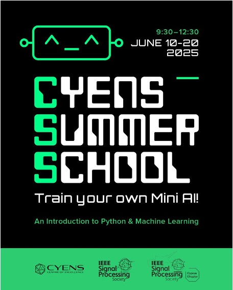

# AI4All-Med
AI4All-Med contains tutorials for introducing AI models for medicine using Python.

This repository includes educational materials from the AIML project that aim to teach AI and Machine Learning using images. The materials provide Google Colab notebooks used in workshops focused on teaching middle-school and high-school students to program AI models using Python. The content includes material for two major projects: the creation of a digital color video using hexadecimal (see Session 8 below), and training multiple AI models (see Session 16 below).  

The workshop was co-sponsored by CYENS, the IEEE Signal Processing Society, and the Cyprus Section of the IEEE Signal Processing Society. 

To run the tutorials, you will need a free Gmail account. To run the tutorials, you will only need to click on the links below. If you need a video introduction on how to run Google Colab notebooks, you can use 
[Google Colab tutorial](https://www.youtube.com/watch?v=RLYoEyIHL6A). 

If you use material from this repository, please cite the original AIML work using: 

APA style: 
<tt>Marios S Pattichis. (2025). pattichis/AIML: An introduction to AI and Machine Learning for middle-school and high-school students (v1.0.0). Zenodo. https://doi.org/10.5281/zenodo.16888480</tt>

IEEE style: 
<tt>Marios S Pattichis, “pattichis/AIML: An introduction to AI and Machine Learning for middle-school and high-school students”. Zenodo, Aug. 17, 2025. doi: 10.5281/zenodo.16888480.</tt>

If you prefer to cite the original workshop itself, you can use: 
<tt>Pattichis, M.S. (2025). Train your own Mini AI!, Summer School, CYENS. Nicosia, Cyprus.
https://github.com/pattichis/AIML.</tt> 

## Sessions

### Session 1. An Introduction
1. [Session 1.1 Introduction to Variables and Strings](Session_1_1_Intro_Variables_Strings_Modules.ipynb)
2. [Session 1.2 Working with AI](Session_1_2_Working_with_AI.ipynb)
3. [Session 1.3 An adversarial attack example of where we are going](Session_1_3_fgsm_tutorial.ipynb)
4. [Session 1.4 A video inference mode example of where we are going](Session_1_4_video_inference_mode.ipynb)

### Session 2. Number Guessing Game 
1. [Session 2. Number Guessing Game](Session_2_Number_Guessing_Game.ipynb)

### Session 3. Loops, conditionals, and sequential thinking 
1. [Session 3.1 Loops, conditionals, and sequential thinking](Session_3_1_Loops_conditionals_sequential_thinking.ipynb)
2. [Session 3.2 Escape the Maze Game](Session_3_2_Escape_the_Maze_Game.ipynb)

### Session 4. Binary numbers and hexadecimals
1. [Session 4.1 Binary numbers and hexadecimals](Session_4_binary_and_hexadecimals.ipynb)

### Session 5. Lists and black and white images
1. [Session 5.1 Lists and black and white images](Session_5_1_Lists_and_black_and_white_images.ipynb)

### Session 6. Color images
1. [Session 6.1 Color images](Session_6_1_color_images.ipynb)

### Session 7. NumPy arrays and color image analysis
1. [Session 7.1 NumPy Arrays](Session_7_1_NumPy_Arrays.ipynb)
2. [Session 7.2 Color image Analysis](Session_7_2_image_analysis_with_color.ipynb)

### Session 8. Video creation project
1. [Session 8.1 Create videos](Session_8_Create_videos.ipynb)
2. [Session 8.2 Video template](Session_8_Video_template.ipynb)

### Session 9. Dictionaries, functions, and object-oriented programming (OOP)
1. [Session 9.1 Dictionaries](Session_9_1_dictionaries.ipynb)
2. [Session 9.2 Functions](Session_9_2_functions.ipynb)
3. [Session 9.3 Object-oriented programming with classes.ipynb](Session_9_3_oop_with_classes.ipynb)

### Session 10. An introduction to neural networks, K-NN, classifiers, and clustering algorithms
1. [Session 10.1 Introduction to nearest neighbor classification](Session_10_1_NN_intro.ipynb)
2. [Session 10.2 MNIST and K-nearest neighbor](Session_10_2_MNIST_and_K_NN.ipynb)
3. [Session 10.3 K-means](Session_10_3_Kmeans.ipynb)
4. [Session 10.4 Classifiers comparisons (from Scikit Learn)](Session_10_4_Classifiers_Comparisons.ipynb)
5. [Session 10.5 Clusterings comparisons (from Scikit Learn)](Session_10_5_Clusterings_Comparisons.ipynb)

### Session 11. An introduction to convolution using tensors
1. [Session 11. An introduction to convolution using tensors](Session_11_tensors_and_convolution.ipynb)

### Session 12. The linear layer
1. [Session 12. The linear layer](Session_12_Linear_Layer.ipynb)

### Session 13. Max pooling
1. [Session 13. Max pooling](Session_13_Max_Pooling.ipynb)

### Session 14. Activation functions
1. [Session 14. Activation functions](Session_14_Activation_Functions.ipynb)

### Session 15. Loss functions
1. [Session 15. Loss functions](Session_15_Loss_functions.ipynb)

### Session 16. Models
1. [Session 16 Models](Session_16_models.ipynb)

## Assignments
The sessions were designed to be self-paced. Work through each Google notebook and try to answer each question.
The following assignments help you think through the material.

### Video project assignment
Complete Sessions 1 through 8. At the end of Session 8, you are provided with a template
to create your own color video. Use the template to create your own color video.

Your video should include:
1. Complex object movements beyond the examples.
2. A minimum of 10 color frames.
3. The use of NumPy array operations as demonstrated in Sessions 1 to 8.

Deliverables:
1. A PDF of the Python code used to make the video.
2. The actual video that was generated.

## Machine learning model training
Session 16 provides parametrizable CNN models that you can train.
Experiment with a few (at least three) CNN models and the Linear model for the given classification problem.

Deliverables:
1. A PDF of the Python code used to generate the different models. Use the provided code to print the architectures and the number of parameters.
2. Screenshots of the achieved accuracy as a function of the number of epochs and the value of the loss function.
3. A discussion comparing the required number of epochs, total number of parameters, final value of the loss function, and achieved accuracy.
